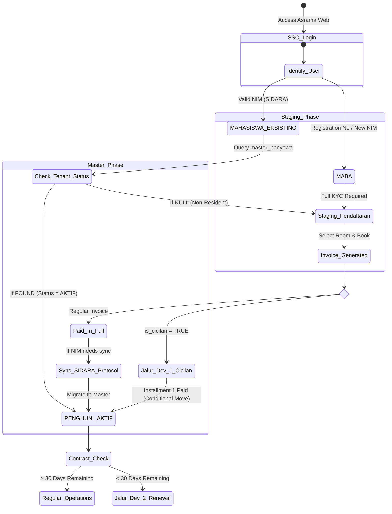

# Asrama Database Interaction & Scenario Mappings

> **Language / Pilihan Bahasa:** [🇮🇩 Bahasa Indonesia (Primary)](scenario-mappings.md) | 🇬🇧 **English Version**

This document defines the 5 primary database interaction scenarios for the Asrama (Dormitory) system. It outlines how the internal Asrama SQL Database routes different users based on their academic state (from SIDARA) and their tenancy state.

---

## 1. Cross-Reference Matrix: The 5 Scenarios

| Scenario | Target User | Database Interaction / Logic | UI / UX Routing |
| :--- | :--- | :--- | :--- |
| **1. Maba New (Onboarding)** | New Student (Registration No / New NIM) | **Check:** `master_penyewa` (NULL). **Action:** Create `users` & `staging_pendaftaran`. | Routed to **Step 1-5 Onboarding**. Requires full KYC (KTP, Selfie) upload. |
| **2. Mahasiswa Eksisting (Non-Tenant)** | Existing Student (Valid NIM) | **Check:** `SIDARA_DB` (Must be Active). **Check:** `master_penyewa` (NULL). **Action:** Create `staging_pendaftaran`. | Routed to **Fast-Track Onboarding**. Skips extensive KYC if SIDARA data exists. |
| **3. Penghuni Aktif (Regular Tenant)** | Existing Room Inhabitant | **Check:** `master_penyewa` (FOUND, Status: AKTIF). **Check:** Contract `tanggal_selesai` > 30 days. | Routed to **Tenant Dashboard**. Access to complaints, monthly bills, gate QR codes. |
| **4. Cicilan Deposit (Installments)** | Maba or Eksisting (with financial aid) | **Check:** `master_pembayaran` (`is_cicilan = TRUE`). **Action:** Query `skema_cicilan` for installment progress. | Routed to **Installment Manager**. Dashboard highlights next due date and locks certain features until 100% paid. |
| **5. Draft Renewal** | Active Tenant (Contract near end) | **Check:** `master_penyewa` (Contract `tanggal_selesai` < 30 days). **Action:** Query `draft_renewal`. | Routed to **Renewal Pipeline**. User must sign the renewal agreement or initiate checkout before accessing regular features. |

---

## 2. Transition State Flow: Student to Room Inhabitant

