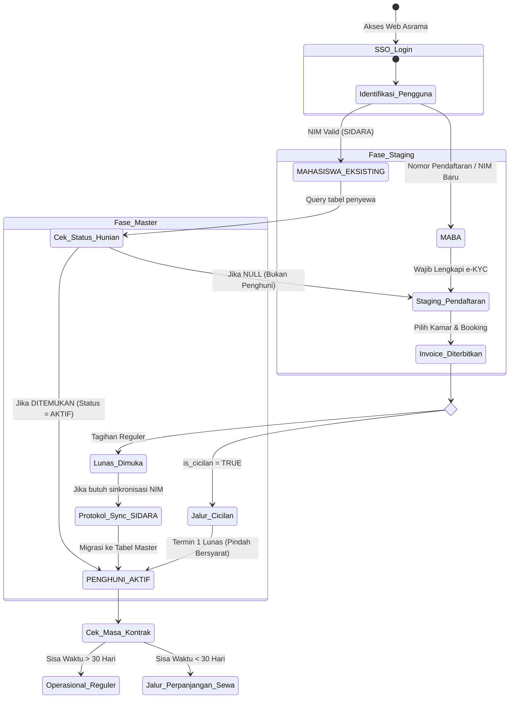

# Interaksi Basis Data & Pemetaan 5 Skenario Pengguna Asrama

> **Pilihan Bahasa / Language:** 🇮🇩 **Bahasa Indonesia (Utama)** | [🇬🇧 English Version](scenario-mappings.en.md)

Dokumen ini mendefinisikan 5 skenario utama interaksi basis data pada sistem Asrama UBT. Dokumen ini memetakan bagaimana basis data operasional asrama mengarahkan alur pengguna berdasarkan status akademiknya (dari SIDARA) dan status huniannya.

---

## 1. Matriks Silang: 5 Skenario Utama

| Skenario | Target Pengguna | Logika / Interaksi Basis Data | Pengalihan Antarmuka (UI/UX) |
| :--- | :--- | :--- | :--- |
| **1. Maba Baru (Onboarding)** | Mahasiswa Baru (No. Reg PMB / NIM Baru) | **Cek:** `penyewa` (NULL). **Aksi:** Buat rekord di `users` & `maba_profiles` (staging). | Diarahkan ke **Admisi 6-Langkah**. Memerlukan verifikasi penuh e-KYC (KTP & Swafoto). |
| **2. Mahasiswa Eksisting (Bukan Penghuni)** | Mahasiswa Aktif Kampus (NIM Valid) | **Cek:** `SIDARA_DB` (Wajib Aktif). **Cek:** `penyewa` (NULL). **Aksi:** Buat rekord di `maba_profiles` (staging). | Diarahkan ke **Fast-Track Pendaftaran**. Melewati verifikasi ulang jika data SIDARA telah lengkap. |
| **3. Penghuni Aktif (Senior Tenant)** | Penghuni Kamar Saat Ini | **Cek:** `penyewa` (DITEMUKAN, Status: AKTIF). **Cek:** Kontrak `tanggal_selesai` > 30 hari. | Diarahkan ke **Dashboard Eksisting**. Akses ke pelaporan perbaikan (tiket), tagihan bulanan, dan barcode gerbang. |
| **4. Cicilan Uang Deposit** | Maba / Penghuni dengan skema termin | **Cek:** `billing_invoices` (`is_cicilan_deposit = TRUE`). **Aksi:** Query `payment_schemes` untuk progres termin. | Diarahkan ke **Manajer Cicilan**. Dashboard menyoroti batas jatuh tempo bulan ke-2 dan membatasi aksi tertentu hingga 100% lunas. |
| **5. Draf Perpanjangan Sewa (Renewal)** | Penghuni Aktif (Kontrak mendekati akhir) | **Cek:** `penyewa` (Kontrak `tanggal_selesai` < 30 hari). **Aksi:** Query antrean draf perpanjangan. | Diarahkan ke **Alur Perpanjangan Kontrak**. Pengguna harus mengonfirmasi perpanjangan atau memulai checkout sebelum mengakses fitur reguler. |

---

## 2. Diagram Alur Transisi Status Mahasiswa Menjadi Penghuni

