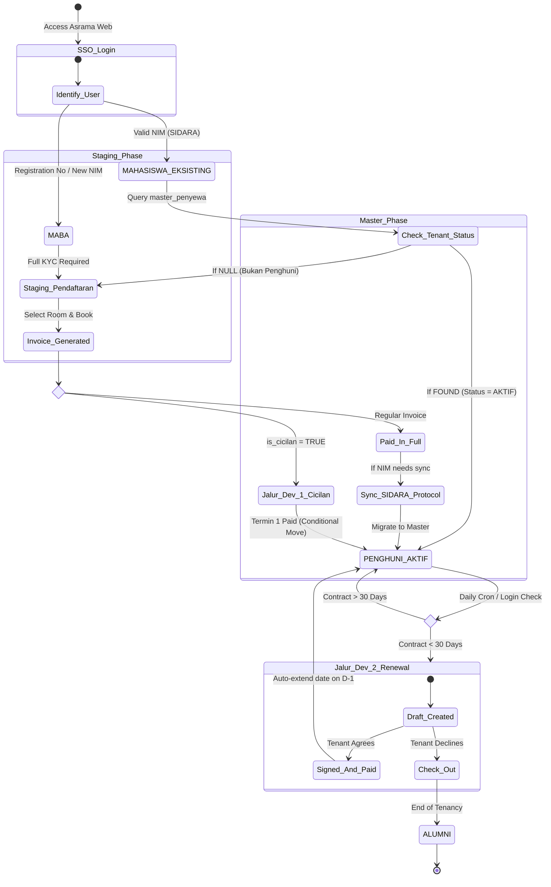
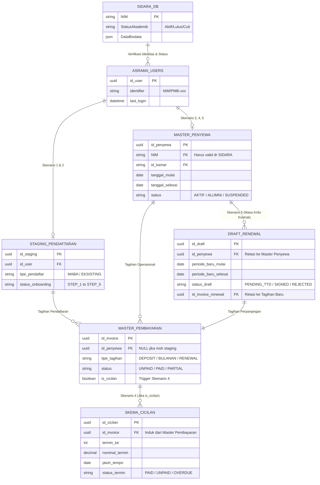

# Asrama Database Interaction & Scenario Mappings

This document defines the 5 primary database interaction scenarios for the Asrama (Dormitory) system. It outlines how the internal Asrama SQL Database routes different users based on their academic state (from SIDARA) and their tenancy state.

## 1. Cross-Reference Matrix: The 5 Scenarios

| Scenario | Target User | Database Interaction / Logic | UI / UX Routing |
| :--- | :--- | :--- | :--- |
| **1. Maba New (Onboarding)** | Mahasiswa Baru (No. Reg / New NIM) | **Check:** `master_penyewa` (NULL). **Action:** Create `users` & `staging_pendaftaran`. | Routed to **Step 1-5 Onboarding**. Requires full KYC (KTP, Selfie) upload. |
| **2. Mahasiswa Eksisting (Non-Tenant)** | Existing Student (Valid NIM) | **Check:** `SIDARA_DB` (Must be Active). **Check:** `master_penyewa` (NULL). **Action:** Create `staging_pendaftaran`. | Routed to **Fast-Track Onboarding**. Skips extensive KYC if SIDARA data exists. |
| **3. Penghuni Aktif (Regular Tenant)** | Existing Room Inhabitant | **Check:** `master_penyewa` (FOUND, Status: AKTIF). **Check:** Contract `tanggal_selesai` > 30 days. | Routed to **Tenant Dashboard**. Access to complaints, monthly bills, gate QR codes. |
| **4. Cicilan Deposit (Installments)** | Maba or Eksisting (with financial aid) | **Check:** `master_pembayaran` (`is_cicilan = TRUE`). **Action:** Query `skema_cicilan` for termin progress. | Routed to **Installment Manager**. Dashboard highlights next due date and locks certain features until 100% paid. |
| **5. Draft Renewal** | Active Tenant (Contract near end) | **Check:** `master_penyewa` (Contract `tanggal_selesai` < 30 days). **Action:** Query `draft_renewal`. | Routed to **Renewal Blocker/Pipeline**. User must sign the new draft or check out before accessing regular features. |

---

## 2. Transition State Flow: Student to Room Inhabitant

The following Mermaid state diagram visualizes the journey of both **Maba** and **Mahasiswa Eksisting** from their initial login towards becoming a fully integrated **Penghuni Aktif** (Room Inhabitant), including how they interact with the Cicilan and Renewal development paths.

### Key Takeaways from the Diagram:
1. **Convergence at Staging**: Both Maba and non-tenant Existing Students converge at the `Staging_Pendaftaran` state. The difference is solely in UI friction (Maba requires full KYC, Existing students might bypass it via SIDARA sync).
2. **Branching at Payment (Dev Path 1)**: The system branches out to handle regular payments versus the `is_cicilan` logic before letting the user into the `PENGHUNI_AKTIF` master state.
3. **Looping at Renewal (Dev Path 2)**: The `PENGHUNI_AKTIF` state is not final; it continuously monitors the contract date, triggering the `Jalur_Dev_2_Renewal` sub-state to either cycle them back into active tenants or exit them to `ALUMNI`.

---

## 3. Database Schema Mapping (ERD)

The following Entity-Relationship Diagram maps how the internal Asrama SQL Database handles the 5 scenarios described above while maintaining clean state separation from the external SIDARA Source of Truth.

